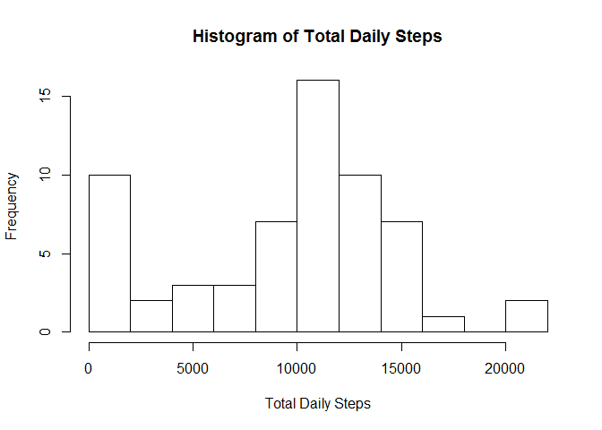

# Reproducible Research: Peer Assessment 1


## Loading and preprocessing the data
First install potentially useful packages.

```r
library("data.table", lib.loc="~/R/win-library/3.3")
library("dplyr", lib.loc="~/R/win-library/3.3")
```

```
## -------------------------------------------------------------------------
```

```
## data.table + dplyr code now lives in dtplyr.
## Please library(dtplyr)!
```

```
## -------------------------------------------------------------------------
```

```
## 
## Attaching package: 'dplyr'
```

```
## The following objects are masked from 'package:data.table':
## 
##     between, first, last
```

```
## The following objects are masked from 'package:stats':
## 
##     filter, lag
```

```
## The following objects are masked from 'package:base':
## 
##     intersect, setdiff, setequal, union
```

```r
library("ggplot2", lib.loc="~/R/win-library/3.3")
library("knitr", lib.loc="~/R/win-library/3.3")
library("lubridate", lib.loc="~/R/win-library/3.3")
```

```
## 
## Attaching package: 'lubridate'
```

```
## The following objects are masked from 'package:data.table':
## 
##     hour, isoweek, mday, minute, month, quarter, second, wday,
##     week, yday, year
```

```
## The following object is masked from 'package:base':
## 
##     date
```
Next, unzip and read the datafile downloaded from the course repository.


```r
unzip("activity.zip", junkpaths = TRUE)
dat <- read.csv("activity.csv")
```

## What is mean total number of steps taken per day?
Caculate the daily total number of steps using summarize() by date over sum(), ignoring "NA" values. Compute mean and median.


```r
daily <- summarize(group_by(dat, date), total = sum(steps, na.rm = TRUE))
mean(daily$total)
```

```
## [1] 9354.23
```

```r
median(daily$total)
```

```
## [1] 10395
```
Make a histogram of the total number of steps per day.


```r
hist(daily$total, breaks = 10, main = "Histogram of Total Daily Steps", xlab = "Total Daily Steps")
```

<!-- -->

## What is the average daily activity pattern?
Calculate the average steps per interval using summarize() by interval over mean(), ignoring "NA" values. Find interval with maximum average number of steps. Report which interval it is as well as the time it starts.


```r
byint <- summarize(group_by(dat, interval), avg = mean(steps, na.rm = TRUE))
maxint <- which.max(byint$avg)
maxint
```

```
## [1] 104
```

```r
dat$interval[maxint]
```

```
## [1] 835
```

The most popular stepping time starts at 8:35am.

## Imputing missing values
It's doubtful that any dates or intervals are missing, but check them with anyNA().


```r
anyNA(dat$date)
```

```
## [1] FALSE
```

```r
anyNA(dat$interval)
```

```
## [1] FALSE
```

Now find how many NA values are in the steps column.


```r
sum(is.na(dat$steps))
```

```
## [1] 2304
```
Fill in missing values with the daily average for that interval.


```r
filldat <- left_join(dat, byint)
```

```
## Joining, by = "interval"
```

```r
filldat$steps[is.na(filldat$steps)] <- filldat$avg[is.na(filldat$steps)]
```

Remove the avg column from filldat to produce the new dataset, equal to the original dataset but with missing values filled in.


```r
filldat <- select(filldat, -avg)
```

## Are there differences in activity patterns between weekdays and weekends?
Weekdays are indexed 2 through 6, leaving indices 1 and 7 for weekends. Create a factor, wkday, that is TRUE for Monday through Friday and FALSE for Saturday and Sunday. Add the factor as a column in the filled-in dataset.


```r
dowk <- wday(as.Date(filldat$date))
wkday <- factor((dowk %in% 2:6), levels = c("TRUE", "FALSE"), labels = c("weekday", "weekend"))
filldat$wkday <- wkday
```

Make the panel plot showing differences in activity patterns on weekdays and weekends.


```r
bydowk <- summarize(group_by(filldat, wkday, interval), avg = mean(steps))
ggplot(bydowk, aes(interval, avg)) + geom_line() + facet_wrap(~wkday, dir = "v") + labs(x = "Interval", y = "Number of Steps")
```

<!-- -->

It seems that, while the 8am to 10am time period is the most popular for stepping on all days, activity is generally higher and more evenly spread throughout (usual) waking hours on weekends.
